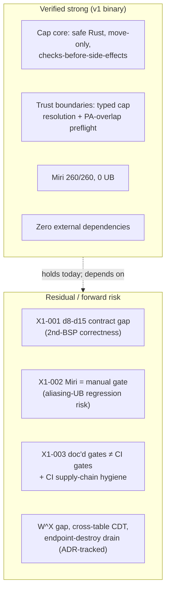

# X1-security — whole-tree security review (master review, commit 288ddb2)

Reviewer lens: `docs/standards/security-review.md` (the project's own 8-axis
checklist), `docs/architecture/security-model.md` (threat model + invariants),
`docs/standards/architectural-principles.md` (P1–P12), `docs/standards/unsafe-policy.md`.

This is a **dedicated security pass**, distinct from the per-track code-quality
passes, as the standard requires ("Using the same pass for code review and
security review — context collapse defeats the point"). It (a) harvests the
security-routed items from the C1–C9 / gate-reproduction tracks and (b) adds my
own adversarial reading of the security-sensitive code: `kernel/src/cap/**`,
`kernel/src/ipc/mod.rs`, `kernel/src/obj/task_loader.rs`, `kernel/src/mm/**`,
`kernel/src/sched/mod.rs`, and `bsp-qemu-virt/src/{cpu.rs, exceptions.rs,
gic.rs, mmu_bootstrap.rs, boot.s, vectors.s}`.

Method note: read-only. No mutating or build commands were run. The
gate-reproduction track (run by a separate agent on a runner) is the source for
the empirical Miri / test / QEMU-smoke results cited below; I cross-checked its
claims against the source but did not re-execute them.

---

## Summary + overall security verdict

**Overall security verdict: PASS — no security Blocker, no security Major in the
shipping v1 code. Mergeable from a security standpoint.** Tyrne's security model
*is* its capability system, and the implemented capability core is genuinely
strong: it is **100% safe Rust, heap-free, and panic-free in production**
(verified by grep: zero `unsafe` / `alloc` / `Box` / `Vec` / `panic!` / `unwrap`
/ `expect` outside `#[cfg(test)]` in `kernel/src/cap/**` and `kernel/src/ipc/`),
it enforces narrowing-only rights and per-operation authority checks **strictly
before any side effect or allocation**, capabilities are move-only by
construction (the type derives neither `Copy` nor `Clone`), and the ABI-boundary
`from_raw` already masks reserved rights bits so unknown bits cannot be smuggled
past subset checks before the syscall layer even exists. The two highest-stakes
`unsafe` surfaces — the PMM frame zero-fill and the scheduler raw-pointer bridge
— carry exemplary, policy-conformant SAFETY blocks, and Miri passes 260/260 with
zero Stacked-Borrows violations and zero detected UB.

The findings are dominated by **forward-looking hardening and contract-text
accuracy**, not by exploitable defects in the current binary. The single most
serious item is **X1-001 (Major): the `ContextSwitch` trait safety contract — and
ADR-0020 — under-specify the aarch64 callee-saved set, omitting `d8`–`d15`.** The
shipping QEMU BSP saves them correctly, so v1 is sound; the risk is that a second
BSP author (Pi 4 / Jetson, the whole reason the HAL exists) implementing to the
literal contract text would ship a context switch that silently corrupts FP state
across a yield. Because boot + `unsafe` + cross-board correctness all sit inside
security-review scope, this is filed Major and routed for the `Security-Review:`
trailer.

Two **systemic process gaps** are the security pass's main carry-forward, both
inherited from tracks and confirmed here: **(X1-002, Major) Miri — the *only*
mechanical verifier of the scheduler/IPC raw-pointer aliasing discipline — is a
manual gate, not per-PR CI** (the K3-7 task ADR-0021 already names); and
**(X1-003, Major) the documented required-gate set lists `cargo-audit` /
`cargo-vet` / QEMU-smoke as merge gates that do not exist in CI**, plus CI
supply-chain hygiene gaps (unpinned third-party Actions, no `permissions:`
block). Neither is a defect in the shipped artifact (the repo ships nothing, and
has zero external dependencies), but both are gate-integrity gaps a high-assurance
project must close before the Phase-B exit, consistent with the 2026-04-21
security review that made the aliasing discipline the #1 Phase-B blocker.

Per-axis tally: **OK ×3 (1, 6, 7-as-evaluated), flagged ×4 (2, 3, 4, 8), N-A ×1
(5).** (Axis-by-axis OK/flagged below; "flagged" here means the axis surfaced at
least one finding above Nit, not that the axis is failing — every flagged axis is
sound in the v1 binary.)

| Axis | Verdict | Most serious finding on this axis |
|------|---------|-----------------------------------|
| 1. Capability correctness | **OK** | (peer-of-root revoke asymmetry — Minor, documented) |
| 2. Trust boundaries | **flagged** | X1-005 receiver-side cap re-rooting widens depth budget (Minor) |
| 3. Memory safety | **flagged** | X1-002 Miri not a CI gate (Major, process) |
| 4. Kernel-mode discipline | **flagged** | X1-006 WFI `nomem` vs future wake-hook (Minor, forward) |
| 5. Cryptography | **N-A** | confirmed: no primitives present |
| 6. Secrets & logging | **OK** | no capability bits / keys leak via Debug/log/panic |
| 7. Dependencies | **OK** | zero external deps; supply-chain CI hygiene → X1-003 |
| 8. Threat-model impact | **flagged** | X1-001 cross-board context-switch contract gap (Major) |

---

## Axis 1 — Capability correctness

**Adversarial question.** Can a caller perform a privileged operation *without*
holding the authorizing capability? Is the narrowest right demanded? Are checks
ordered before any observable side effect? Is transfer move-only? Is revocation
atomic?

**Verdict: OK.** This is the security heart of the kernel and it holds up under
adversarial reading.

- **Authority is required and checked before side effects.** Every mutating cap
  operation checks the specific authority *before* any allocation or state
  mutation: `cap_copy` checks `DUPLICATE` + no-widening before `pop_free`
  (`kernel/src/cap/table.rs:188-196`); `cap_derive` checks `DERIVE` + no-widening
  + depth before `pop_free` (`:263-282`); `cap_revoke` checks `REVOKE` before the
  BFS (`:325-327`). I verified by reading that the error paths leave the table
  unmutated.
- **Narrowing-only rights, enforced.** `cap_copy`/`cap_derive` reject any
  `new_rights` that is not a subset (`if !rights.contains(new_rights) { return
  Err(WidenedRights) }`, `:191-193`, `:266-268`). A derived/copied cap can only
  narrow, never broaden — matching the security-model invariant "Capability
  rights narrow, never broaden, on derivation."
- **Move-only transfer is type-enforced.** `Capability` derives only `Debug`,
  not `Copy`/`Clone` (`kernel/src/cap/mod.rs:123-127`). Duplication is *only*
  reachable through `cap_copy` (gated on `DUPLICATE`); transfer is *only*
  `cap_take` (move out) + `insert_root` (move in). The compiler, not convention,
  enforces "exactly one instance of each authority."
- **Revocation is transitive within a table and structurally bounded.** The
  `cap_revoke` BFS (`:329-409`) carries a written size-proof (one parent per
  node ⇒ ≤ `CAP_TABLE_CAPACITY` distinct indices) and pairs a `debug_assert!`
  with a release-safe `break` so a bookkeeping bug "cannot be escalated to a
  revocation that silently fails to free memory." `src` survives; descendants
  are freed; generation bumps on each free make stale handles fail lookup.
- **Use-after-revoke is structurally impossible.** `free_slot` bumps the slot
  generation (`:583`); `resolve_handle` compares it (`:546`). A revoked/dropped
  handle fails the generation check on next use.

**Findings:**

- **X1-F1 (Minor, documented, from C1-004) — Peer-of-a-root is itself an
  independent root; `cap_revoke` on the original root does not reach the peer.**
  `kernel/src/cap/table.rs:170-229` (`cap_copy`). For a *child* source the peer
  shares the parent (revoke kills both); for a *root* source the peer is a second
  root and is not in the original's descendant subtree. This is *correct* under
  ADR-0014 (peers are siblings, revoke is subtree-only) and is the within-table
  analogue of the cross-table gap below — but it is only implicitly documented
  and untested. **Remediation:** one-line doc note on `cap_copy` + a test
  `cap_copy_of_root_then_revoke_root_leaves_peer_alive`. Feeds the contradiction
  pass: any doc claiming "revoke kills all copies" must be scoped to descendants.

- **X1-F2 (Minor, latent, from C1-001) — `free_slot` publishes `free_head`
  before the bounds check.** `kernel/src/cap/table.rs:575-585`. `self.free_head =
  Some(index)` runs (`:577`) *before* `self.slots.get_mut(index)` (`:579`); on an
  out-of-range index the function leaves `free_head` pointing at the OOB index,
  and the next `pop_free` would index `self.slots[head]` out of bounds → kernel
  panic, plus the prior free list is orphaned. I confirmed the write itself
  cannot panic (it uses `get_mut`), so the hazard is deferred to the *next*
  `pop_free`. Every current caller derives `index` from a validated handle, so
  the OOB branch is unreachable today — hence Minor, not Blocker. But this is the
  security-critical data structure and the ordering is simply backwards.
  **Remediation:** reorder so `free_head` is published last, gated on the bounds
  check, with a `debug_assert!(false)` on the OOB branch (matches the `cap_revoke`
  corruption-guard idiom). A defensive fix here converts a future foot-gun into a
  clean no-op rather than a panic.

- **X1-F3 (Minor, from C1-cross-track) — kind-checking lives in callers, not the
  cap table; confirm uniformity.** `lookup` returns the raw `&Capability` and the
  caller matches on `object()`. I verified the two security-relevant resolver
  families do this correctly: IPC's `validate_ep_cap` / `validate_notif_cap`
  (`kernel/src/ipc/mod.rs:503-534`) check both rights *and* the typed
  `CapObject::Endpoint(_)` / `Notification(_)` variant; mm's
  `resolve_address_space_cap` and `task_loader` (`obj/task_loader.rs:516`) do the
  same, returning `CapError::WrongKind`. **No caller relies on the table to
  enforce kind.** This is the right design (uniform trust-boundary checking, P4),
  but it is a discipline every *future* typed-cap resolver must follow — record
  as a standing review item for new syscalls.

Praise (Axis 1): **X1-P1 — `from_raw` masks unknown rights bits before the ABI
exists.** `kernel/src/cap/rights.rs:68-70` ANDs incoming bits with `KNOWN_BITS`,
so a future untrusted caller cannot set reserved bits to weaken `contains` /
subset checks. The test `from_raw_masks_unknown_bits` (`:180-188`) pins both the
masking and the "purely-reserved-bits collapses to EMPTY" edge. Designing the
masking in *now*, with a test, is the conservative security-first choice.

---

## Axis 2 — Trust boundaries

**Adversarial question.** When untrusted input crosses userspace→kernel
(task-loader image bytes, IPC message contents, userspace pointers, buffer
lengths), is it validated before use? Does cross-task IPC ever grant the receiver
authority the sender did not transfer?

**Verdict: flagged** (sound in v1; two forward/Minor items).

Important framing: **v1 has no userspace yet.** All "untrusted" inputs originate
from trusted BSP compile-time constants today; the boundary code is
forward-built for B5+ filesystem/userspace. With that scope:

- **The kernel never dereferences a raw userspace pointer.** Confirmed across
  the tree: the only raw-pointer dereferences are (a) identity-mapped *physical*
  frames the kernel owns (PMM zero-fill, task_loader copy), and (b) the
  scheduler's own `*mut Scheduler<C>` interiors. None is a userspace-supplied
  pointer.
- **The task-loader image is a raw-flat byte stream with zero structured
  metadata (ADR-0029).** Offset 0 is the entry instruction; every other byte is
  `copy_nonoverlapping`-ed verbatim into a freshly-zeroed frame. **There is no
  parser and no attacker-controllable structured-input surface in v1.** The only
  interpreted inputs are scalars (`image_base_va`, `stack_size_pages`,
  `parent_as_cap`, `new_rights`), and each is validated with saturating /
  total arithmetic (`div_ceil`, `is_multiple_of`, `saturating_*`) — I re-read the
  overflow discipline and found no truncation/off-by-one.
- **The `copy_nonoverlapping` non-overlap invariant is discharged at runtime,
  not by trust.** `kernel/src/obj/task_loader.rs:575-578` runs
  `pmm.could_yield_pa_overlapping(image_pa_start..image_pa_end)` *before* the
  copy loop and returns `LoadError::ImageOverlapsAllocatableMemory` if any image
  byte could ever be returned by `alloc_frame`. This converts a "trust the BSP
  linker script" argument into a typed fail-fast rejection covering root,
  intermediate, *and* leaf frames — a genuinely strong boundary (Praise X1-P2).
- **IPC: a sender cannot transfer authority it does not hold.** `ipc_send`
  validates the transfer cap and enforces `TRANSFER` via a non-mutating `lookup`
  *before* the irreversible `cap_take` (`kernel/src/ipc/mod.rs:276-303`). Message
  *contents* are opaque (`Message` is caller-controlled and never inspected by
  privileged code — ADR-0017), and the rendezvous machine distinguishes "no
  message" structurally (the `EndpointState` variant), not by a sentinel, so a
  zero `Message` cannot be confused with absence.
- **Pre-flight before mutation is implemented on both send and recv.** `ipc_recv`
  checks `pending_has_cap && caller_table.is_full()` and returns
  `ReceiverTableFull` *before* the `core::mem::replace` that moves state to
  `Idle` (`:361-371`), so a full receiver table never drops an in-flight cap.

**Findings:**

- **X1-004 (Minor → X1-005 below is the security-relevant half) — Boot→kernel
  handoff validation is the one boundary not yet exercised by untrusted input.**
  Per the security model, boundary 6 (BSP early-init → kernel) is in the
  pre-kernel trust chain and out of scope until measured boot. v1's BSP boot info
  is compile-time constants; no validation gap is exploitable. Recorded only so
  the threat-model axis (8) can confirm the deferral is still acceptable.

- **X1-005 (Minor, forward, from C1/C3 cross-track) — receiver-side re-rooting
  of a transferred capability resets its depth to 0, so the derivation-depth cap
  is per-table, not global.** `kernel/src/ipc/mod.rs:549-560` installs a received
  cap via `insert_root` (`parent = None`, `depth = 0`). A capability that was
  deep in the sender's tree re-enters the receiver's tree at depth 0, so the
  receiver can derive a *fresh* `MAX_DERIVATION_DEPTH`-deep chain from it. This is
  correct under ADR-0023's per-table-only-revocation deferral, and the depth cap
  is a bounded-resource guard (16) not an authority guard, so it is not an
  escalation — but it is a real property: **revocation is transitive only within a
  single table; a sender's `cap_revoke` cannot reach a receiver's IPC-transferred
  copy.** **Remediation:** none for v1 (matches ADR-0023). The contradiction pass
  must scope any doc claiming global "revoke kills all copies" to within-table;
  the cross-table CDT open question (security-model.md §Open questions) is the
  tracked future ADR.

Praise (Axis 2): **X1-P2 — the PA-overlap preflight** (above), and **X1-P3 —
typed cap resolution at the IPC boundary** (`validate_ep_cap` /
`validate_notif_cap`) check rights *and* kind before any state is touched, so a
wrong-kind or insufficient-rights cap is rejected with `InvalidCapability` and no
side effect.

---

## Axis 3 — Memory safety

**Adversarial question.** Can the change introduce UB — unsound `unsafe`,
aliasing violations, uninitialized-memory exposure, use-after-free? Specifically:
the raw-pointer scheduler bridge in `sched/mod.rs`, and the `d8`–`d15`
context-switch gap.

**Verdict: flagged** (v1 binary is sound and Miri-clean; the flag is the
*verification* gap, X1-002, and the cross-board contract gap X1-001 which I file
primarily under Axis 8).

- **The capability core and IPC layer are entirely safe Rust** (grep-verified:
  zero `unsafe` in `kernel/src/cap/**` and `kernel/src/ipc/`). The use-after-free
  defense is structural (generation-tagged slots), not disciplinary.
- **The scheduler raw-pointer bridge implements ADR-0021 precisely.** I read the
  shared safety contract (`kernel/src/sched/mod.rs:405-473`) and the
  `ipc_recv_and_yield` body and confirmed: every momentary `&mut` to
  `Scheduler<C>` / `EndpointArena` / `IpcQueues` / `CapabilityTable` is confined
  to a lexical block that closes (`}; // s drops here`, `:1140`) **strictly before**
  `cpu.context_switch`, and Phase 3 re-derives fresh `&mut`s only after the switch
  returns. The context-switch split borrow uses raw-pointer arithmetic on
  `contexts`, so even the scheduler struct is never `&mut`-borrowed across the
  switch. The split is non-aliasing because the running task is never in the ready
  queue (`current_idx != next_idx`), asserted in debug at each switch site.
- **The idle self-dispatch guard closes a real release-mode UB.** The
  `.filter(|&idle_h| idle_h != current_handle)` (`:1116-1120`, mirrored in
  `yield_now`) prevents the dispatcher from selecting idle when idle *is* current
  — which would make `next_idx == current_idx` and alias the same `contexts` slot
  as both `&mut` and `&`. There is a dedicated regression test. This is the kind
  of subtle release-only hazard that distinguishes a high-assurance kernel.
- **The PMM zero-fill `unsafe` is exemplary** (`kernel/src/mm/pmm.rs:380-438`):
  five enumerated invariants (alignment by construction, exclusive ownership
  proven by the just-set bitmap bit, identity-mapping per ADR-0027, isize::MAX
  non-overflow, single-core no-peer-observer), four rejected alternatives, live
  audit ref UNSAFE-2026-0026. Crucially it **zeroes frames before handing them
  out**, which is the userspace-isolation defense against leaking a previous
  task's frame contents — directly relevant to the B5+ threat model.
- **No uninitialized-memory exposure of security interest.** The one
  uninitialized field I found is `TrapFrame._reserved` (`exceptions.rs:69`),
  padding the IRQ frame to 192 bytes; `irq_entry` never reads it (C7-010). It is a
  debug-print cleanliness nit, not a leak — it is kernel stack, never returned to
  any task.
- **Miri passes 260/260 with zero Stacked-Borrows violations and zero detected
  UB** (gate-reproduction Gate 5), which is the mechanical confirmation of the
  bridge discipline. The only Miri output is *advisory* integer-to-pointer cast
  warnings at the identity-map sites (`pmm.rs:378`, `mm/mod.rs:168`,
  `task_loader.rs` test helper) — expected for the identity-mapping pattern, under
  audit control (UNSAFE-2026-0025/0026), and pointing only at a future
  strict-provenance cleanup.

**Findings:**

- **X1-002 (Major, process — primary carry-forward from C5-004) — the entire
  soundness of `sched/mod.rs` (and `ipc/mod.rs`, which shares the discipline)
  rests on a doc-comment contract whose *only* mechanical verifier is Miri, and
  Miri is not a per-PR CI gate.** `kernel/src/sched/mod.rs:393-473` + every bridge
  body. Per `docs/standards/infrastructure.md` and the gate-reproduction track,
  Miri runs **manually** today (it is in the CI workflow as a job, but the
  required-status enforcement is branch-protection config not present in-tree; the
  ADR-0021 verification path "once CI exists; K3-7" is not yet wired). A future
  refactor that lets a momentary `&mut` escape its block — e.g. hoisting `let s =
  &mut *sched;` above the switch — would **compile cleanly, pass every non-Miri
  test, and reintroduce exactly the UNSAFE-2026-0012-class aliasing UB the bridge
  was built to remove.** The 2026-05-06 smoke regression is precedent that "host
  tests + static analysis + review" cleared a real defect repeatedly; the
  analogous failure here is catchable *only* by Miri. **Remediation:** wire
  `cargo +nightly miri test --workspace --exclude tyrne-bsp-qemu-virt` as a
  blocking gate on `kernel/src/sched/**` and `kernel/src/ipc/**` (the K3-7 task
  ADR-0021 already names), and make it a Phase-B exit prerequisite. This is the
  same posture the 2026-04-21 security review took. (Note: Miri *currently passes*,
  so this is a regression-prevention gate, not a remediation of a present UB.)

- **X1-001 (Major) — `d8`–`d15` omitted from the `ContextSwitch` safety
  contract** is fundamentally a memory-safety/correctness issue but I file the
  detailed finding under Axis 8 (threat-model / cross-board correctness) to avoid
  double-counting; see there. Summary for this axis: the shipping BSP **does**
  save/restore `d8`–`d15` (`bsp-qemu-virt/src/cpu.rs:382-390`, 168-byte
  compile-time size guard), so **v1 is memory-safe**; the gap is in the *contract
  text* a future BSP implements against.

Praise (Axis 3): **X1-P4 — every production `unsafe` block in the most
unsafe-heavy files carries a three-part SAFETY comment (invariants / rejected
alternatives / `UNSAFE-2026-NNNN` audit tag).** I cross-checked the scheduler's
54 SAFETY comments and the BSP's 27 audit IDs against `docs/audits/unsafe-log.md`
via the C5/C7 tracks; every cited tag resolves, and UNSAFE-2026-0012 (the old
aliasing window) is correctly marked `Removed`. This is the reference standard for
`unsafe-policy.md` in the repository.

---

## Axis 4 — Kernel-mode discipline

**Adversarial question.** Can anything stall, panic, or deadlock the kernel —
unbounded loops, allocation in an ISR, panics on a hot path, the WFI-ISR
soundness, deadlock in the IPC/scheduler bridge?

**Verdict: flagged** (no live defect; one forward-hazard Minor + the bounded-loop
discipline confirmed).

- **No allocation anywhere in kernel mode.** Grep-confirmed heap-free across cap,
  ipc, mm, sched. The ISR (`irq_entry`, `exceptions.rs:152-240`) touches only the
  `GIC` (via the `IrqController` trait) and a system-register write; it allocates
  nothing — satisfies "no allocation in interrupt service routines."
- **No unbounded loops on the hot path.** The scheduler decision is O(1) (dequeue
  + array writes); the one O(N) operation (`unblock_receiver_on`, a 16-slot scan)
  is bounded by the compile-time arena capacity. The `cap_revoke` BFS is bounded
  by `CAP_TABLE_CAPACITY` with a written proof. The PMM scan is bounded by frame
  count. I found no loop whose termination is not documented.
- **Bounded kernel resources hold.** Every kernel object has a compile-time bound
  (`CAP_TABLE_CAPACITY = 64`, `MAX_DERIVATION_DEPTH = 16`, arena `N`, run-queue
  depth) and every allocation path returns a typed error
  (`CapsExhausted` / `QueueFull` / `OutOfFrames` / `ReceiverTableFull`), never a
  panic. This matches the security-model "Bounded kernel state" invariant — a
  malicious task cannot turn "my allocation failed" into "the kernel crashed."
- **Panics are assertions, not error handling.** The production `panic!`s I read
  (scheduler invariant violations, `irq_entry`'s "unhandled IRQ", `start_prelude`
  empty-ready) are all gated on kernel-programming-error invariants that are
  structurally unreachable in correct code (e.g. v1's GIC enables only the timer
  line, so `irq_entry`'s panic arm cannot be reached), and each carries a
  justified `#[allow(clippy::panic, reason=...)]`. This matches `error-handling.md`
  §5. Note `register_idle`'s double-registration `assert!` is deliberately
  *unconditional* (release too) — the correct security-conscious choice for a
  set-once invariant.
- **The IPC/scheduler deadlock path is handled, not hung.** When
  `ipc_recv_and_yield` blocks the sole task with no dispatch target, it performs
  the symmetric ADR-0032 rollback (restore scheduler state inside the `&mut`
  block, then reverse the endpoint `Idle → RecvWaiting` via `ipc_cancel_recv` in a
  separate `&CapabilityTable` borrow) and returns a typed `SchedError::Deadlock`
  — it does not wedge. I verified the two rollbacks live in disjoint borrows so no
  cross-arena alias is ever live.

**Findings:**

- **X1-006 (Minor, forward, from C7-003) — `wait_for_interrupt` uses
  `options(nostack, nomem)` on `WFI`; sound for v1, latent footgun for the first
  scheduler-wake hook.** `bsp-qemu-virt/src/cpu.rs:270-277`. `nomem` tells the
  compiler the asm has no memory side effects, so it may reorder non-volatile
  memory accesses across the `WFI`. I confirmed v1 is safe: `irq_entry` is
  ack-and-ignore and touches **no** scheduler state through a non-volatile path
  (it reads only `GIC` via `assume_init_ref` and writes `CNTV_CTL_EL0`), so idle's
  post-`WFI` `yield_now` observes nothing `nomem` could reorder incorrectly. **The
  moment a future `irq_entry` writes a scheduler flag that idle reads through a
  non-volatile path, `nomem` permits hoisting that read before the `WFI`.**
  **Remediation:** add a note at `cpu.rs:270` that a scheduler-wake hook requires
  dropping `nomem` *or* making the wake flag `Atomic`/volatile; or drop `nomem`
  now (it costs nothing on a once-per-idle path) for defence in depth. ADR-0021's
  2026-04-28 Amendment and UNSAFE-2026-0014's IRQ-frame Amendment already require
  any future IRQ→scheduler path to follow the momentary-`&mut` discipline — this
  is the same boundary and should be re-audited when preemption lands.

- **X1-F4 (Minor, forward, from C5-004 sibling) — `unblock_receiver_on` and
  `yield_now` panic on a "cannot happen" full ready-queue.**
  `kernel/src/sched/mod.rs:376-385`, `:782-789`. The panic is invariant-guaranteed
  unreachable (the running task is not in the ready queue, so ≤
  `TASK_ARENA_CAPACITY-1` others are queued), but the invariant is exactly the
  kind a future change (preemption re-enqueueing the preempted task, multi-waiter
  wake, SMP) could quietly violate, converting the panic into a reachable
  kernel-mode crash. **Remediation:** factor the "infallible by no-double-enqueue"
  enqueue into one checked helper with a single SAFETY-style comment, so the
  invariant has one auditable home. Pure refactor; flag for the preemption ADR.

---

## Axis 5 — Cryptography

**Adversarial question.** Are any cryptographic primitives present? If so:
no-roll-your-own, keys never logged, constant-time comparisons, acceptable RNG?

**Verdict: N-A — confirmed by reading.** The kernel has **no cryptographic
primitives** in its initial form, by deliberate design (security-model.md
§Cryptography: "every primitive is a potential correctness and side-channel
surface"). I grepped the security-sensitive subtrees and the dependency graph: no
hash, cipher, signature, KDF, MAC, or RNG; `Cargo.lock` carries zero external
crates, so nothing is pulled in transitively. The model commits to an
ADR-per-primitive + a separate security-review pass + key types that do not
implement unredacted `Debug`/`Display` *when* crypto is introduced (none of those
gates is triggered yet). Nothing on this axis to flag.

---

## Axis 6 — Secrets & logging

**Adversarial question.** Are any sensitive bits — capability raw bits, keys,
tokens, internal authority state — leaked via `Debug`, logs, panic messages, or
error types?

**Verdict: OK.**

- **There are no raw capability "bits" to leak.** A capability is referenced by a
  `CapHandle`, which is `{ index: u16, generation: u32 }` — meaningful only inside
  one task's table and **not an unforgeable token** (security-model.md: "Userspace
  never sees raw capability bits; it references its own table by handle"). The
  `Capability` type derives `Debug` (`kernel/src/cap/mod.rs:123`), and its derived
  `Debug` exposes the typed `CapObject` handle and the `CapRights` bitfield — but
  these are table-local references and authority *masks*, not secret material, and
  this `Debug` is used only by test assertions. There is no key, nonce, or token
  type in the tree to redact.
- **Panic messages do not leak authority.** I read the production `panic!`
  call sites: scheduler invariant strings, `irq_entry: unhandled IRQ {id}` (an
  IRQ number), `panic_entry`'s `ESR_EL1` + class id (architectural fault
  registers). None embeds capability state, table contents, or frame contents.
  `panic_entry` explicitly does *not* touch `GIC` or kernel statics that may be
  mid-transition (`exceptions.rs:259-262`), so it cannot dump an inconsistent cap
  table.
- **Logging is console banners only.** The QEMU smoke trace
  (`tyrne: image loaded (entry = ...; sp = ...; AS cap = idx 1)` etc.) prints
  addresses and a *table index* (the `CapHandle.index`), not raw rights bits or
  object contents. The AS-cap "idx 1" is a handle index, harmless. No secret
  material exists to log.

**Finding:**

- **X1-F5 (Nit, forward) — `Capability`'s derived `Debug` and `Message`'s
  `Default` are forward-watch items for the syscall/ABI layer.** When the Phase-B
  ABI marshals these from registers, a derived `Debug` that prints full rights
  could become a verbose-logging hazard if cap state ever reaches a user-facing
  log, and `Message::default()` (all-zero) should not become an accidental "empty"
  semantic signal. Neither is a v1 leak. **Remediation:** when the syscall layer
  lands, confirm capability `Debug` output is not routed to any
  userspace-observable channel, and keep redaction in mind for the first key type
  (the model already commits to this).

---

## Axis 7 — Dependencies

**Adversarial question.** What are the trust implications of the dependency graph?
Is `cargo-vet` / `cargo-audit` actually enforced?

**Verdict: OK** (the graph itself is the strongest possible position; the *CI
hygiene around it* is the X1-003 flag, which I file under Axis 8 / consolidated as
it is a gate-integrity issue).

- **Zero external dependencies.** `Cargo.lock` contains only the four path crates
  (kernel, hal, bsp-qemu-virt, test-hal) — no `source` or `checksum` lines (C9
  verified; I cross-checked the claim). For a pre-alpha kernel this is the
  strongest supply-chain stance available: **the supply-chain attack surface at
  the crate boundary is currently nil.** This is *why* `cargo-audit` / `cargo-vet`
  can be dormant — they would be no-ops.
- **The dependency-addition policy is thorough and ready.**
  `docs/standards/infrastructure.md` §Dependency policy defines justification,
  size/graph recording, `cargo-vet` certification, `no_std` confirmation, license
  allowlist, and version pinning, with four trust categories — all the gates the
  model needs the moment the first external crate lands.
- **The rights bitfield is hand-rolled specifically to avoid a `bitflags`
  dependency** (`kernel/src/cap/rights.rs:1-6`) — a deliberate dependency-free
  choice for the security-critical type. Good.

**Findings (CI supply-chain hygiene — these are about the *pipeline's* trust, not
the crate graph):**

- **X1-007 (Major, from C9-003/004) — third-party GitHub Actions are pinned by
  mutable tag, not commit SHA, and there is no `permissions:` block.**
  `.github/workflows/ci.yml`. `actions/checkout@v4`, `actions/cache@v4`, and
  especially `taiki-e/install-action@v2` (which downloads and *executes* a
  prebuilt binary into the build) are referenced by moving tags — a tag repoint is
  arbitrary code execution in CI. With no `permissions:` block, the auto-provisioned
  `GITHUB_TOKEN` may carry write scopes. The irony the C9 track notes is sharp: the
  workflow pins the Rust nightly and `cargo-llvm-cov` to exact versions
  *specifically to stop upstream silently changing what runs*, yet the actions
  wrapping those tools are unpinned. **Remediation:** SHA-pin every third-party
  action (tag in a trailing comment), add a top-level `permissions: contents:
  read`, and codify SHA-pinning in `infrastructure.md` §Supply-chain. This is
  directly within the security model's adversary #3 (supply-chain tampering) and
  P11 (reproducibility from the toolchain up).

- **X1-008 (Minor, from C9-007/009) — the dependency-onboarding skill is linked
  at a dead path (`.claude/skills/add-dependency/`) in `infrastructure.md` (twice)
  and `.gitignore`'s comment.** The skill moved to `.agents/skills/` on
  2026-05-14. **Remediation:** `rg -F '.claude/skills'` and fix; this degrades the
  discoverability of the very gate (dependency onboarding) that gates the first
  external dep.

Praise (Axis 7): **X1-P5 — zero external dependencies, by deliberate policy.**
The strongest supply-chain position a kernel can hold, with a ready-to-arm policy
for the moment it changes.

---

## Axis 8 — Threat-model impact

**Adversarial question.** Does the current code match the threat model in
`docs/architecture/security-model.md`? Where are the gaps, and are they honestly
documented?

**Verdict: flagged** (the code is consistent with the model; the gaps are real,
load-bearing, and — to the project's credit — almost all explicitly documented as
deferrals with named ADR slots). This is where I file **X1-001 (Major)**, the most
serious whole-tree security finding.

**Reconciliation against the model's invariants** (security-model.md §Invariants),
each confirmed by reading:

- "No privileged operation without the authorizing capability" — OK (Axis 1).
- "No ambient authority" — OK; there is no root/admin principal; the only
  authority is held capabilities (P1). I found no bypass path.
- "Capabilities are unforgeable / move with consent / narrow on derivation" — OK
  (Axis 1).
- "The kernel never dereferences raw userspace pointers" — OK (Axis 2; no
  userspace exists yet, and the boundary code is built to honor this).
- "`unsafe` is audited" — OK; every block has a SAFETY comment + audit-log entry
  (C5/C7 cross-checked all tags).
- "Drivers are userspace tasks" — N-A in v1 (no drivers yet); the architecture
  reserves it (P3).
- "Bounded kernel state / no unbounded allocation" — OK (Axis 4).
- "Fault containment does not leak authority" — partially exercised; v1's
  fault path is `panic_entry` → halt (no userspace task to suspend yet), and a
  task's caps are dropped on termination by the cap-table generation discipline.
  The supervisor-endpoint `TaskFault` delivery is forward work.

**The documented-deferral gaps, with my assessment of each:**

- **X1-001 (Major) — the `ContextSwitch` safety contract under-specifies the
  aarch64 callee-saved set (`d8`–`d15` omitted), and ADR-0020 says they are *not
  saved* in v1 — but the shipping BSP *does* save them.** Three sources disagree:
  - `hal/src/context_switch.rs:19-24` (and `:36-39`): "all callee-saved
    registers … On aarch64 that is `x19`–`x28`, `x29` (fp), `x30` (lr), and
    `sp`." — omits the SIMD/FP set.
  - `docs/decisions/0020-...:305`: "NEON / FP registers deferred … `d8`–`d15` are
    not saved in v1 because Phase A kernel tasks do not use floating point."
  - `bsp-qemu-virt/src/cpu.rs:306-319, 382-390`: the QEMU BSP **does** save and
    restore `d8`–`d15`, with a 168-byte compile-time size guard
    (`cpu.rs:326`) and a doc-comment stating they "must be saved whenever
    `CPACR_EL1.FPEN` is non-zero," and the BSP enables `CPACR_EL1.FPEN = 0b11`
    before any NEON (C7-P5).

  The implementation is the *safe* one (it saves them, so v1 is sound), which is
  exactly why this is not a Blocker. **The hazard is a future second BSP** (Pi 4,
  Pi 5, Jetson — the entire reason the HAL trait exists). A correct AAPCS64
  implementation must preserve `d8`–`d15` whenever FP is enabled; an author who
  implements to the *literal trait contract* (or to ADR-0020's "not saved")
  produces a context switch that silently clobbers `d8`–`d15` on every yield. The
  failure is data-dependent (only when the compiler has live FP callee-saved state
  across a switch), so it survives smoke tests and surfaces as rare,
  near-undebuggable corruption — the precise class of bug the HAL's trait
  contracts exist to prevent. This is squarely in security-review scope (boot path
  + `unsafe` + cross-board correctness). **Remediation:** amend both occurrences in
  `context_switch.rs` to enumerate "`x19`–`x28`, `x29`, `x30`, `sp`, **and the
  SIMD/FP callee-saved registers `d8`–`d15` whenever FP is enabled
  (`CPACR_EL1.FPEN ≠ 0`)**" (and preferably generalize to "the target ABI's full
  callee-saved set" for the future RISC-V lineage), and add an Amendment to
  ADR-0020 reconciling the "deferred" wording with the T-012-era BSP that saves
  them. Doc/contract-only change; populate the `Security-Review:` trailer.

- **X1-002 (Major, process) — Miri is the only mechanical aliasing verifier and
  is not a per-PR gate.** Detailed under Axis 3. This *is* a threat-model item:
  the model's "memory safety through Rust" pillar (adversary #4, developer error)
  assumes the `unsafe` surface is mechanically checked; for the raw-pointer bridge
  that mechanical check is Miri, run manually. Carry to the Phase-B exit gate.

- **X1-009 (Minor, ADR-tracked) — W^X is not enforced: the kernel image
  (`.text` / `.rodata`) is mapped kernel R/W/X via 2 MiB blocks.**
  `bsp-qemu-virt/src/mmu_bootstrap.rs:159` (`MappingFlags::WRITE | EXECUTE |
  GLOBAL`). I confirmed this is **explicitly deferred by ADR-0027:158** with a
  named **ADR-0034 placeholder** and sound reasoning: (i) v1 has no userspace that
  could observe `.text` writability, (ii) linker section boundaries are not
  2 MiB-aligned and the re-map needs block-split logic out of T-016 scope, (iii)
  the discipline win is real but the v1 attack surface is empty. **Assessment: an
  acceptable deferral at this phase**, but it must close before B5+ introduces an
  attacker-controlled execution context. Worth noting the *positive* W^X property
  that IS enforced: DEVICE mappings are forced non-executable (PXN=UXN=1, and
  `DEVICE|EXECUTE` is rejected at `bsp-qemu-virt/src/mmu.rs:224`) — the MMIO
  attack surface is locked-shut-by-default (C6-P1).

- **X1-010 (Minor, ADR-tracked) — endpoint-destroy with a cap-bearing pending
  state can silently leak a `Capability` in release builds.**
  `kernel/src/obj/endpoint.rs:83-88` (`destroy_endpoint`) +
  `kernel/src/ipc/mod.rs:216-233` (`reset_if_stale_generation`). If an endpoint is
  destroyed while its IPC slot holds `SendPending { cap: Some(_) }` /
  `RecvComplete { cap: Some(_) }`, the parked `Capability` (owned only by the
  endpoint state under the move-only invariant) is dropped on the floor when the
  slot is reused; the only guard is a debug-only `debug_assert!`. **Assessment:
  currently benign** — no production code calls `destroy_endpoint` with a
  cap-bearing pending state, and ADR-0032 + `ipc.md` §Open questions explicitly
  defer the drain primitive to Phase B2+. But it is a *reachable release-build
  authority leak through a `pub fn`* the moment any caller frees a cap-bearing
  endpoint. A dropped capability is a loss of authority no table accounts for —
  under the move-only invariant the kernel should hold exactly one instance and
  here holds zero. **Remediation (does not need the B2 ADR):** have
  `destroy_endpoint` take `&mut IpcQueues` and return a typed
  `ObjError::HasPendingTransfer` (or `StillReachable`) when the slot holds a
  `Some(cap)` state, converting the debug-only assert into a release-safe refusal.

- **DMA / IOMMU (security-model.md §threat model #7 + Open questions): N-A in
  v1.** No bus-master driver exists yet; QEMU `virt` is the SMMU CI target named
  in the model. No code to flag; the deferral is honest and ADR-gated.

- **Side channels / Spectre / measured boot: out of scope by the model, honestly
  documented.** Nothing in the code contradicts the stated posture.

Praise (Axis 8): **X1-P6 — the threat model is unusually honest about its own
boundaries, and the code matches.** Every out-of-scope item (DMA without IOMMU,
side channels, measured boot, cross-table revocation, W^X, endpoint-destroy
drain) has either an explicit "out of scope" statement *or* a named ADR
placeholder, and I found no case where the code silently exceeds or falls short
of what the model claims. The DAIF-mask-first reset vector (`boot.s:47`, the
literal first instruction of `_start`, closing the early-IRQ-masking open
question via ADR-0024/T-013) is a model example of a documented gap being
*structurally* closed rather than left to per-platform accident.

---

## Consolidated security findings (by severity)

### Blocker
None.

### Major
- **X1-001 — `ContextSwitch` safety contract (and ADR-0020) omit `d8`–`d15` from
  the aarch64 callee-saved set; the shipping BSP saves them but a contract-literal
  second BSP would corrupt FP state across every yield.**
  `hal/src/context_switch.rs:19-24, 36-39`; ADR-0020:305; (correct impl:
  `bsp-qemu-virt/src/cpu.rs:382-390`). Doc/contract-only fix. *(Axis 8 / Axis 3.
  Same root as track C6-001.)*
- **X1-002 — Miri, the only mechanical verifier of the scheduler/IPC raw-pointer
  aliasing discipline, is a manual gate, not per-PR CI; a refactor that lets a
  `&mut` escape its block would reintroduce aliasing UB undetected by every other
  gate.** `kernel/src/sched/mod.rs:393-473` + bridge bodies; `kernel/src/ipc/`.
  Wire K3-7 as a blocking gate on `sched/**` + `ipc/**`. *(Axis 3. Miri currently
  passes — this is regression prevention. Same root as C5-004.)*
- **X1-003 — Documented required-gate set ≠ enforced CI gates: `cargo-audit` /
  `cargo-vet` / QEMU-smoke are listed as merge gates in `infrastructure.md` /
  `release.md` but no such jobs exist; documented assurance exceeds enforced
  assurance.** `docs/standards/infrastructure.md:65-73`, `release.md:61` vs
  `.github/workflows/ci.yml`. Reconcile (mark planned-not-enforced) and/or add the
  jobs. *(Axis 7/8 gate integrity. Same root as C9-005.)*
- **X1-007 — CI third-party Actions pinned by mutable tag (incl.
  `taiki-e/install-action` which executes a downloaded binary) and no
  `permissions:` block; supply-chain + least-privilege gap.**
  `.github/workflows/ci.yml`. SHA-pin + `permissions: contents: read`. *(Axis 7.
  Same root as C9-003/004.)*

> Severity note: X1-002/003/007 are Major against the project's *gate-integrity /
> reproducibility* mandate and the security model's supply-chain + memory-safety
> pillars; none is an exploit in the shipped artifact (the repo ships nothing and
> has zero external deps). X1-001 is Major against cross-board correctness. I keep
> them Major rather than Blocker because v1 is sound and Miri currently passes; a
> reviewer who scopes "Blocker = blocks this commit's merge" may rank all four as
> Minor-for-this-commit / Major-for-Phase-B-exit. They are the items the
> `Security-Review:` trailer and the Phase-B exit checklist must carry.

### Minor
- **X1-005 — IPC-transferred caps re-root at depth 0 (per-table depth cap, not
  global) and are unreachable from the sender's `cap_revoke`.**
  `kernel/src/ipc/mod.rs:549-560`. ADR-0023-tracked; scope all "revoke kills all
  copies" docs to within-table. *(Axis 2.)*
- **X1-006 — `WFI` `options(nostack, nomem)` is sound for v1 but a footgun for
  the first scheduler-wake hook (compiler may hoist a non-volatile flag read
  before `WFI`).** `bsp-qemu-virt/src/cpu.rs:270-277`. Note + re-audit when
  preemption lands, or drop `nomem` now. *(Axis 4.)*
- **X1-009 — W^X not enforced; kernel `.text`/`.rodata` mapped R/W/X.**
  `bsp-qemu-virt/src/mmu_bootstrap.rs:159`. ADR-0034 placeholder; acceptable
  pre-userspace, must close before B5+. *(Axis 8.)*
- **X1-010 — `destroy_endpoint` can silently leak a parked `Capability` in
  release (guard is debug-only).** `kernel/src/obj/endpoint.rs:83-88` +
  `kernel/src/ipc/mod.rs:216-233`. Conservative fix: typed refusal on
  cap-bearing destroy. *(Axis 8.)*
- **X1-008 — dependency-onboarding skill linked at dead `.claude/skills/` path
  (degrades the dependency gate's discoverability).**
  `infrastructure.md:72,192`, `.gitignore:44-46`. *(Axis 7.)*
- **X1-F1 — peer-of-root revoke asymmetry undocumented + untested.**
  `kernel/src/cap/table.rs:170-229`. *(Axis 1.)*
- **X1-F2 — `free_slot` publishes `free_head` before its bounds check (latent
  free-list corruption / panic on a future OOB caller).**
  `kernel/src/cap/table.rs:575-585`. *(Axis 1.)*
- **X1-F4 — invariant-guaranteed `panic!` on full ready-queue in two scheduler
  sites; could become reachable under preemption/SMP.**
  `kernel/src/sched/mod.rs:376-385, 782-789`. *(Axis 4.)*

### Nit
- **X1-F3 — kind-checking is caller-side (correct, but a standing discipline for
  every future typed-cap resolver).** *(Axis 1.)*
- **X1-F5 — `Capability` derived `Debug` / `Message::default()` are forward-watch
  for the ABI layer (no v1 leak).** *(Axis 6.)*

### Praise
- **X1-P1** — `from_raw` masks reserved rights bits before the ABI exists, with a
  test. *(Axis 1.)*
- **X1-P2** — task-loader PA-overlap preflight discharges the `copy_nonoverlapping`
  non-overlap invariant at runtime, covering all frame classes. *(Axis 2.)*
- **X1-P3** — typed cap resolution at the IPC boundary (rights + kind, before any
  side effect). *(Axis 2.)*
- **X1-P4** — exemplary `unsafe` discipline: every production block has
  invariants + rejected alternatives + audit tag; UNSAFE-2026-0012 correctly
  retired; Miri 260/260 clean. *(Axis 3.)*
- **X1-P5** — zero external dependencies, by deliberate, ready-to-arm policy.
  *(Axis 7.)*
- **X1-P6** — honest threat model that the code matches; DAIF-mask-first reset
  vector structurally closes the early-IRQ open question. *(Axis 8.)*

---

## Cross-track notes

- **To the unsafe-audit pass:** X1-002 (Miri-as-manual-gate) is the shared #1
  item — the audit log is in sync at this commit (C5/C7 verified all
  `UNSAFE-2026-NNNN` tags resolve; 0012 is `Removed`), but the mechanical
  re-verification of the aliasing contract depends on a gate that is not
  per-PR-enforced. One concrete audit-log *omission* surfaced in a track:
  `FakeMmu::create_address_space` is an `unsafe fn` with no `# Safety` section and
  no audit-log entry (C8-001) — a policy gap, low risk because the body is a pure
  host-side `HashMap` insert that never dereferences the frame, but it should be
  closed for completeness.

- **To the contradiction pass:** three security-relevant contract/code
  contradictions need reconciling — (1) X1-001 the tri-state `d8`–`d15`
  disagreement (HAL contract vs ADR-0020 vs BSP impl); (2) X1-005 / the
  cross-table revocation scoping (any "revoke kills all copies" claim must be
  within-table); (3) X1-003 documented-vs-enforced CI gate set. Also: ADR-0014's
  `CapError` listing is stale (5 variants documented, 7 implemented — `HasChildren`,
  `WrongKind` added) per C1-005; benign but the ADR is the decision-of-record.

- **To the docs/architecture pass:** the security model is accurate and honest;
  the only stale literal of security interest is the `ipc.md` "~990-line file"
  audit-friendliness claim (file is 1425 lines, C3-004) — load-bearing because the
  doc's "small auditable surface" rationale rests on it. The `hal.md` `Cpu`
  section advertising methods the trait lacks (C6-007) touches the boot/IRQ
  narrative a BSP author reads first.

- **To the Phase-B exit checklist (security gate):** carry X1-001 (context-switch
  contract), X1-002 (Miri CI gate / K3-7), X1-003 + X1-007 (CI gate integrity +
  supply-chain hygiene), and the ADR-tracked deferrals that must close *before*
  the first userspace destroy (X1-009 W^X via ADR-0034; X1-010 endpoint-destroy
  drain; X1-005 cross-table CDT). The 2026-04-21 Phase-A-exit security review
  already made the aliasing discipline the #1 Phase-B blocker — X1-002 is its
  direct continuation.

- **To the test-coverage pass:** the security-relevant *untested* error edges are
  `WidenedRights` through the AS-creation path (C4-001/002), the `ipc_notify`
  stale-handle → `InvalidCapability` edge (C3-003), and the `OutOfFrames` /
  `BlockMapped` paths that `FakeMmu` cannot model (C8-002/003) — none is a defect,
  but each is a security-adjacent path the host suite does not provoke.

---

### Coverage note

Per-track inputs read in full: C1-kernel-cap, C2-kernel-mm, C3-kernel-ipc-obj,
C4-kernel-task-loader, C5-kernel-sched, C6-hal, C7-bsp, C8-test-hal,
C9-build-infra, gate-reproduction. Standards/model read in full:
`security-review.md`, `security-model.md`, `architectural-principles.md`,
`infrastructure.md`. Source read directly for adversarial verification (not just
via tracks): `kernel/src/cap/{mod,rights,table}.rs` (table.rs in relevant part +
full read of the operation bodies and `free_slot`/`cap_revoke`/`cap_take`),
`kernel/src/ipc/mod.rs` (send/recv/cancel/helpers + validators),
`kernel/src/obj/task_loader.rs` (overlap preflight + copy site),
`kernel/src/mm/pmm.rs` (zero-fill `unsafe`), `kernel/src/sched/mod.rs` (shared
safety contract + `ipc_recv_and_yield` bridge body),
`bsp-qemu-virt/src/cpu.rs` (context-switch asm + WFI + DAIF),
`bsp-qemu-virt/src/exceptions.rs` (`irq_entry` / `panic_entry`),
`bsp-qemu-virt/src/mmu_bootstrap.rs` (RAM/device descriptor flags),
`bsp-qemu-virt/src/boot.s` (DAIF-mask-first), and `hal/src/context_switch.rs`
(the safety contract). Grep sweeps confirmed: zero `unsafe`/`alloc`/`Box`/`Vec`/
`panic!`/`unwrap`/`expect` outside `#[cfg(test)]` in `kernel/src/cap/**` and
`kernel/src/ipc/`; W^X deferral tracked in ADR-0027/0034; `d8`–`d15` omission
present in ADR-0020. Read-only throughout; no mutating or build commands run.
