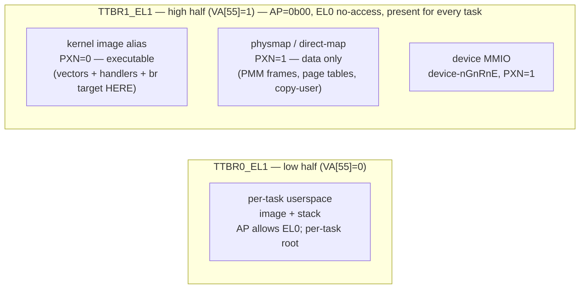

# 0033 — Kernel high-half migration

- **Status:** Proposed
- **Date:** 2026-05-29
- **Deciders:** @cemililik

## Context

Milestone B6 ("first userspace hello") must run a real EL0 task: a separate binary in its own address space that makes a `console_write` syscall through the lower-EL `VBAR_EL1 + 0x400` vector and exits via `task_exit`. There is a hard architectural prerequisite that gates the entire milestone: **the kernel must stay reachable from every task's active translation regime.**

Today the loader's userspace address space ([`task_loader.rs`](../../kernel/src/obj/task_loader.rs)) holds **only** the image + stack mappings — no kernel mappings. The MMU runs identity-only in `TTBR0_EL1` ([ADR-0027](0027-kernel-virtual-memory-layout.md)): `TTBR1_EL1 = 0`, `TCR_EL1.EPD1 = 1`. The moment a real EL0 task is dispatched with its own `TTBR0_EL1`, an `SVC` (or any exception) vectors the CPU to `VBAR_EL1` and **fetches the trampoline instruction** — which lives at a kernel physical address that is **not mapped in that task's `TTBR0_EL1`**. The result is a translation fault on the vector fetch, recursively, with no recovery. B5's syscall boundary smoke worked only because the EL1 kernel-stub ran in the bootstrap address space, where the kernel is identity-mapped; a real EL0 task has no such luxury. [phase-b §B6](../roadmap/phases/phase-b.md#milestone-b6--first-userspace-hello) states it plainly: *"Nothing in B6 runs until this is solved."*

[ADR-0027 §Decision outcome (a)](0027-kernel-virtual-memory-layout.md) anticipated exactly this moment and **signposted the answer**: a high-half kernel. It reserved `TTBR1_EL1` (with `EPD1 = 1`), pre-committed the high-half-friendly `TCR_EL1` fields (`TG1 = 0b10`, `T1SZ = 16`, `IRGN1`/`ORGN1`/`SH1` already cacheable-inner-shareable), and named ADR-0033 as the home of "the `TTBR0_EL1`-swap discipline that arrives with userspace." This ADR settles that migration: **how the running kernel moves from its identity/low mapping to a high-half (`TTBR1_EL1`) mapping, so the kernel is present in every address space's high half while `TTBR0_EL1` is freed for per-task userspace.** (ADR-0027 framed this as opening "when B5 userspace work surfaces the per-task `TTBR0_EL1` swap"; in practice B5 closed as the syscall ABI + the EL1-stub `+0x200` proxy, and the real EL0 task — hence the per-task swap — moved to B6, so this migration opens at **B6**, not B5.)

The stakes are high: the migration switches the running kernel's own instruction-fetch, stack, and exception-vector translation regime *mid-flight*; a single wrong step (an unmapped fetch, a stale TLB entry, a surviving low-VA pointer, a relocation that resolves to the wrong half) halts the kernel unrecoverably. The §Simulation below was hardened against two independent adversarial verification passes during drafting — the first caught and corrected an architecturally-impossible "trampoline mapped in both regimes" step (impossible with disjoint `TTBR0`/`TTBR1` input ranges); their record is in [T-022 §Review history](../analysis/tasks/phase-b/T-022-high-half-kernel-mapping.md). The §Dependency chain is explicit that the migration requires **new infrastructure** that does not exist in the tree today — a link-high/load-low linker discipline, a position-independent low-linked early-boot section, and the **two distinct PA↔VA offsets** (the kernel-image *link* offset and the *physmap*/direct-map offset; see §"High-half layout" + §Dependency chain step 2 — conflating them is a bug).

## Decision drivers

- **Security-first kernel/user isolation ([CLAUDE.md #1](../../CLAUDE.md), [architectural-principles](../standards/architectural-principles.md)).** A high-assurance capability kernel wants the kernel to be *structurally absent* from the user-active translation regime — not present-but-AP-protected. Absence means no `AP`/`UXN`/`PXN` descriptor bit can leak the kernel, and the Meltdown/transient-execution substrate is reduced, rather than relying on a per-descriptor invariant that must never be wrong on any of N user address spaces.
- **Honour the Accepted direction without a supersede.** [ADR-0027](0027-kernel-virtual-memory-layout.md) chose high-half as the future shape and pre-paid for it (the single `EPD1 = 1 → 0` flip; the byte-stable `TG1`/`T1SZ`/`IRGN1`/`ORGN1`/`SH1` fields). Adopting any non-high-half end-state would silently override that and force a `supersede-adr` move.
- **Bounded, one-time migration risk over a standing invariant.** The high-half transition carries a one-time bricking-hazard window; the alternative (kernel mapped into every `TTBR0`) carries a *standing* per-descriptor AP invariant on every address space forever. A high-assurance project prefers a bounded, verified, one-time risk to a permanent must-never-get-wrong surface.
- **Minimum surface per milestone ([CLAUDE.md #6](../../CLAUDE.md)).** B6 already lands many firsts (EL0 entry, `ERET`-to-EL0, the per-task `TTBR0` swap, the three T-021 carry-forward gates, `userland/hello`, `tyrne-user`). The migration must not be *bundled* with those firsts — it lands as its own staged, independently-reviewed task ([T-022](../analysis/tasks/phase-b/T-022-high-half-kernel-mapping.md)) **before** the EL0 work builds on the clean high-half regime.
- **Relocation feasibility.** The kernel image is currently linked at a fixed low VA (`ORIGIN = 0x4008_0000`); `boot.s` uses `adrp`/`:lo12:` (PC-relative) and `addr_of!` (treated as `VA == PA`). A high-half kernel must be *linked* high but *loaded* low, which means the early-boot path that runs before the high regime is live must resolve **low** — a non-trivial link-split + position-independence discipline the convention must make explicit, not assume.
- **Single-core simplicity (v1).** No TLB shootdown / cross-core inner-shareable migration; the existing `DSB ISH` discipline forward-extends to SMP (Phase C) without a barrier-scope rewrite.

## Considered options

1. **High-half migration** — relink the kernel at a high base (ARM convention `0xFFFF_FFFF_8000_0000+`), keep it loaded at PA `0x4008_0000` (link-high/load-low), and migrate the running kernel from identity/low (`TTBR0_EL1`) to high (`TTBR1_EL1`) **at boot time** (inside the bootstrap, before any state or interrupt source exists), then free `TTBR0_EL1` for per-task userspace.
2. **Map the kernel into every per-task `TTBR0_EL1`** — keep `EPD1 = 1`/`TTBR1 = 0`; point each per-task root's kernel-range slots at shared kernel intermediate tables (global, privileged-only entries) so the kernel is reachable from every task's own `TTBR0`.
3. **Defer the migration past B6** — leave identity-only; do not make the kernel reachable from per-task address spaces; keep exercising the syscall path only through the B5 EL1-stub proxy.

## Decision outcome

Chosen option: **Option 1 — high-half kernel migration, performed at boot time, landed as a dedicated staged task ([T-022](../analysis/tasks/phase-b/T-022-high-half-kernel-mapping.md)) before B6's EL0 work.**

High-half is the structural kernel/user separation the project's high-assurance positioning requires (driver 1) and the direction [ADR-0027](0027-kernel-virtual-memory-layout.md) already signposted and pre-paid for (driver 2) — adopting Option 2 as the *end-state* would silently override that Accepted decision and force a supersede. Option 3 blocks the entire B6 milestone ([phase-b §B6](../roadmap/phases/phase-b.md#milestone-b6--first-userspace-hello)) and is recorded only to reject it honestly.

Two refinements make the choice safe and methodical:

- **Boot-time, not mid-kernel.** The migration runs inside the bootstrap window (within / immediately after [`mmu_bootstrap`](../../bsp-qemu-virt/src/mmu_bootstrap.rs), before the kernel's `StaticCell`s are written and before the GIC/timer is initialised). This is decisive for risk: an adversarial review of a *mid-kernel* migration found the dominant bricking hazards came from migrating a **live** kernel — `DAIF` unmasked, surviving low-VA `StaticCell` pointers, a live timer IRQ. At boot all three evaporate by construction: `DAIF` is masked from `_start` (`boot.s` `msr daifset, #0xf`, `SPSR_EL2 = 0x3c5`), no `StaticCell` holds a low VA yet (`kernel_entry` writes them *after* the migration returns, so they store high VAs), and no interrupt source is live. What remains is the irreducible core of any high-half jump — the relocation discipline and the `br` that crosses regimes — handled in the controlled boot window.
- **Staged, not bundled.** [T-022](../analysis/tasks/phase-b/T-022-high-half-kernel-mapping.md) lands the migration **alone** (relink, the low-linked early-boot section, the high-half table builder, the trampoline, the `KERNEL_VA_OFFSET` PA↔VA helper, the per-task `TTBR0` swap going live) and is reviewed on its own. B6's EL0-entry / `task_create_from_image` / carry-forward-gate / `userland` tasks then build on the settled high-half regime, satisfying [CLAUDE.md #6](../../CLAUDE.md).

`TCR_EL1.A1` stays `0` and the ASID stays in `TTBR0_EL1.ASID`: the kernel moves to `TTBR1` and the **user**-half stays on `TTBR0`, so the `A1 = 0 → 1` flip [ADR-0027 §"ASID"](0027-kernel-virtual-memory-layout.md) conditionally named (only for a *TTBR1-swap user-half*) does **not** apply here.

**ASID policy (v1) — `ASID = 0` global + flush-on-swap; the allocator is deferred.** v1 keeps **`ASID = 0` globally** (per [ADR-0027 §"ASID"](0027-kernel-virtual-memory-layout.md)). Correctness across the per-task `TTBR0` swap comes from a **TLB flush on every swap**, not from ASID-tagging: [`QemuVirtMmu::activate`](../../bsp-qemu-virt/src/mmu.rs) already issues `TLBI` + `DSB ISH` after writing `TTBR0_EL1`, so the swap going live needs no new ASID machinery — only the [T-018](../analysis/tasks/phase-b/T-018-address-space-kernel-object.md) differ-path firing for distinct roots. A **real per-task ASID allocator** — the `AddressSpace::asid` field [ADR-0028 forward-flagged](0028-address-space-data-structure.md), plus a reuse / generation / exhaustion policy and the resulting `TLBI`-avoidance — is a **TLB-flush-avoidance optimisation, not a B6 correctness requirement** (v1's single userspace task gains nothing from it) and is **deferred** to a future task/ADR when multi-task TLB pressure surfaces. T-022 therefore does **not** add the `asid` field; it keeps `ASID = 0` + flush-on-swap, and this ADR does **not** make per-task ASID assignment a B6 deliverable.

Option 2 is recorded as a **credible, non-strawman alternative** — it deletes the entire bricking-hazard family and is the lighter continuation of the shipped architecture. It is rejected as the *end-state* (the standing per-descriptor AP invariant inside a user-reachable regime plus the transient-execution exposure outweigh the one-time migration risk for a kernel that markets itself high-assurance), but it **remains the documented fallback** if T-022's link-split / position-independence discipline proves intractable on the toolchain (see §Consequences → Negative).

### High-half layout (the `TTBR1_EL1` tables T-022 builds)

Mirroring [ADR-0027 §Decision outcome (a)](0027-kernel-virtual-memory-layout.md)'s enumeration discipline, the high-half root populates exactly three regions (4 KiB granule, 48-bit VA, `T1SZ = 16` ⇒ `TTBR1` serves `VA[55] = 1`):



| Region | High VA → PA | Access (`AP`) | Exec (`PXN`/`UXN`) | Mem type / `SH` |
|--------|--------------|---------------|--------------------|-----------------|
| Kernel image (`.text`/`.rodata`/`.bss` + boot stack) | `[KBASE .. KBASE+image_size)` → `[0x4008_0000 ..)` (`KBASE = 0xFFFF_FFFF_8008_0000`) | **`AP = 0b00`** — EL1 RW, **EL0 no-access** | **`PXN = 0` / `UXN = 1`** (EL1-exec, EL0 no-exec) | normal-cached, `SH = 0b11` (inner-shareable), `AF = 1`, `nG = 0` |
| Kernel physmap (direct map) | a high window → all RAM PA `[0x4000_0000 .. 0x4800_0000)` | **`AP = 0b00`** — EL1 RW, EL0 no-access | **`PXN = 1` / `UXN = 1`** (data — PMM frames, page tables, copy-user buffers by PA) | normal-cached, `SH = 0b11` (inner-shareable), `AF = 1`, `nG = 0` |
| Device MMIO | a high window → `[0x0800_0000 .. 0x0920_0000)` | **`AP = 0b00`** — EL1 RW, EL0 no-access | `PXN = 1` / `UXN = 1` | device-nGnRnE, `SH = 0b00` (non-shareable), `AF = 1`, `nG = 0` |

Two pins this table makes load-bearing:

- **`AP = 0b00` on every kernel region is what makes "the kernel is not leakable to EL0" concrete** — not merely the kernel living in `TTBR1`. `UXN = 1` blocks EL0 *execute* only; EL0 *read/write* isolation is the `AP[1] = 0` (EL0-no-access) encoding. While an EL0 task runs, `TTBR1` is the active high-half regime, so an EL0 access to any high VA must fault on `AP` — the structural-absence claim rests on this bit. (`AP[2] = 0` keeps EL1 read-write; per-section read-only hardening is [ADR-0034](0027-kernel-virtual-memory-layout.md).)
- **The boot stack lives in the kernel-image region** (`.bss`-resident `__stack_top`), so it is RW and — like the whole v1 image — `PXN = 0`. Per-section discipline (`.text` RX, `.rodata` R, `.bss`/stack RW-`NX`) is [ADR-0034](0027-kernel-virtual-memory-layout.md)'s deferred job; v1 maps the whole image uniformly, exactly as the identity map it replaces did. The §Simulation row-2 `SP`-rebase targets this region.

The kernel image is therefore reachable at two high VAs — the executable image alias (`PXN = 0`) and the physmap alias (`PXN = 1`). **The migration's branch target and `VBAR_EL1` must resolve into the `PXN = 0` image window**; a target landing in the `PXN = 1` physmap alias is an execute-never permission fault on the first high fetch (a correctness pin T-022 must hold, surfaced by the §Simulation review).

### Simulation

The worst-case boot-time transition — the running kernel switching its own PC/SP/`VBAR` translation regime from identity/low to high-half while executing. The **early-boot + migration code is *low-linked* and position-independent** (a `.idmap`-style section that resolves `VA == PA` while the MMU is off / identity-only); the **main kernel is *high-linked***; the `br` in row 2 is the boundary. `DAIF` is masked throughout (boot window).

| Step | State pre | Action | State post | Observable / verification |
|------|-----------|--------|------------|---------------------------|
| 0 | Low-linked early boot running at PA `0x4008_NNNN` (MMU on, identity `TTBR0`); `TTBR1 = 0`; `EPD1 = 1`; `DAIF` masked. Image relinked at `KBASE` but loaded at PA `0x4008_0000`. | Build the high-half `TTBR1` tables (the three regions above) in reserved frames, writing descriptors via the host-tested `vmsav8` encoders + `write_volatile` on `*mut u64` whose target PAs are computed from the kernel-image **link offset** (`symbol_VA − KERNEL_IMAGE_LINK_OFFSET`), **not** `addr_of!`-as-PA — see §Dependency chain step 2. Barrier order: **`DSB ISH`** (publish the descriptor writes to the table walker — *before* the walker can be enabled) → `MSR TTBR1_EL1, <high_root_pa>` → **`ISB`** (context-synchronise the register write). The `DSB` precedes the `MSR` (and necessarily the row-1 `EPD1` clear), so no walk can read a stale/zero descriptor. | `TTBR1` populated + synchronised; `EPD1` still `1`, so no high VA translates yet; PC/SP/`VBAR` still low (identity unchanged). | T-022 `vmsav8` high-half encoder host tests + UNSAFE-2026-0022 Amendment (descriptor writes into high-half frames). |
| 1 | `TTBR1` populated, `EPD1 = 1`, kernel executing low. | `MSR TCR_EL1, <EPD1-cleared value>` — only `EPD1` `1 → 0`; **every `TTBR0`-governing field (`T0SZ`/`EPD0`/`TG0`/`IRGN0`/`ORGN0`/`SH0`) byte-identical to the live `TCR_EL1_VALUE`** (a new pinned constant; perturbing any `TTBR0` field faults the *next* low fetch). `ISB`. (No pre-flip `TLBI` of the high range: with `EPD1 = 1` a `TTBR1` walk faults and the architecture caches no result, so there is nothing stale to drop — the §Simulation review corrected the earlier "pre-flip TLBI" rationale.) | Both regimes live simultaneously: low identity (`TTBR0`) **and** high (`TTBR1`). The ranges are disjoint (`VA[55] = 0` low / `= 1` high), so coexistence is sound. PC/SP/`VBAR` still low. | UNSAFE-2026-0023 Amendment (`EPD1`-clear `MSR`, same EL1-sysreg class as the bootstrap block). |
| 2 | Dual-live; `EPD1 = 0`; PC/SP/`VBAR` low; `DAIF` masked. | **The crossing.** Executing from the low-linked `.idmap` (PC-relative-safe, `VA == PA` under `TTBR0`): (1) `MSR VBAR_EL1, <high_vbar>` + `ISB` — high vectors live **before** the branch, so any synchronous fault on the first high fetch vectors to the `TTBR1`-mapped handler; (2) rebase `SP` to the high-VA boot stack (`__stack_top` in the **kernel-image region**, `AP = 0b00` RW in `TTBR1`); (3) `LDR xN, =<high_continuation>` (literal in the `.idmap` section so it resolves correctly while low) → `BR xN` — PC physically crosses from a low `.idmap` VA to a **`PXN = 0` image-window** high VA. The low idmap stays live (TTBR0 not yet nulled) as a safety net; the window takes no exception (`DAIF` masked; the few instructions cannot fault if the high image window is correctly populated). | PC/SP/`VBAR` resolve high via `TTBR1`. | **NEW** UNSAFE-YYYY-NNNN (the absolute-jump trampoline asm; invariants: `.idmap` low-linked + PIC, literal pool in `.idmap`, target in the `PXN = 0` window, `VBAR`-high-before-`br`, `SP`-high-mapped-before-`br`, `DAIF` masked). |
| 3 | PC/SP/`VBAR` high; low idmap still live. **No live low-VA pointer exists** — `StaticCell`s are unwritten (`kernel_entry` writes them after the migration returns, storing high VAs); the only low references were in `.idmap`, which the PC has left. | `MSR TTBR0_EL1, xzr`; set `TCR_EL1.EPD0 = 1`; `ISB`; `TLBI VMALLE1`; `DSB ISH`; `ISB` (registers only — no table-memory mutation, so no `DSB` *before* the `TLBI` is required). | Final high-half steady state: kernel on `TTBR1` (`EPD1 = 0`); `TTBR0` free/null for per-task userspace (`EPD0 = 1` until a task AS activates); stale low translations flushed. Control returns to the high-linked `kernel_entry`; `StaticCell` init + GIC + PMM + loader + demo all run high. A real EL0 task's `TTBR0` carries only its own user mappings; its `SVC` vector fetch goes to the high `VBAR` mapped in `TTBR1` (present for every task), so `+0x400` + the EL1 handler translate. | UNSAFE-2026-0023 + 0024 Amendments (`TTBR0`-null/`EPD0`-set + post-flip `TLBI`) + **NEW** entry for the per-task `TTBR0` swap going live; T-018 `activate`-differ host test. |
| 4 | Any step's precondition violated. | **Abort discipline.** A boot-time regime switch has **no runtime rollback** — once row 2's `br` executes, row 3 destroys the low regime. Safety is therefore *design-time* (per-region table verified, `.idmap` link-split, the ordering + `PXN`-window pins above) **plus** the QEMU smoke gate: a wrong step fail-stops (hangs) before the new `tyrne: high-half active` marker and before `tyrne: all tasks complete`, so the [business master-plan closure-smoke gate](../analysis/reviews/business-reviews/master-plan.md) blocks the merge. | No silent-wrong-kernel ships: a broken migration is a visible boot hang, not a passing build. Milestone fallback: Option 2. | The smoke marker + `-d int,unimp,guest_errors` (zero new Translation/Permission faults) is T-022's runtime gate. |

#### Simulation row-to-verification mapping

Per the [`write-adr` skill §Procedure step 5 sub-bullet](../../.agents/skills/write-adr/SKILL.md), each row maps to a verification artefact in [T-022](../analysis/tasks/phase-b/T-022-high-half-kernel-mapping.md), recorded in its review-history row on completion:

- **Row 0** → `vmsav8` high-half encoder host tests (the three-region descriptor encodings, `AP`/`PXN`/`UXN`/`SH`/`AF`/`nG` per region) + host tests for **both** PA↔VA offsets (the image-link offset and the physmap offset) + UNSAFE-2026-0022 Amendment.
- **Row 1** → a host test pinning the `EPD1`-cleared `TCR_EL1` constant is byte-identical to `TCR_EL1_VALUE` except bit 23 + UNSAFE-2026-0023 Amendment.
- **Row 2** → the new absolute-jump-trampoline UNSAFE entry + the QEMU smoke showing the `tyrne: high-half active` marker after the jump (the runtime proof the crossing reached the `PXN = 0` window).
- **Row 3** → UNSAFE-2026-0023 / 0024 Amendments + the per-task-`TTBR0`-swap UNSAFE entry + the T-018 `activate`-differ host test (now exercised with distinct ASes).
- **Row 4** → the QEMU smoke gate (full trace to `tyrne: all tasks complete`; `-d int,unimp,guest_errors` zero new fault classes).

### Dependency chain

For this decision to be **fully** in effect:

```text
1. Link-high/load-low linker discipline: relink the kernel at KBASE
   (0xFFFF_FFFF_8008_0000), keep LMA low via `AT`, and a low-linked
   position-independent `.idmap`-style early section for boot.s + the
   table builder + the trampoline.                                    — T-022 (opens with this ADR)
2. TWO distinct PA<->VA offsets (NOT one "KERNEL_VA_OFFSET" — they are
   different mappings, and conflating them is a bug):
   - KERNEL_IMAGE_LINK_OFFSET = KBASE - KERNEL_IMAGE_PHYS_BASE
     (0xFFFF_FFFF_8008_0000 - 0x4008_0000). A kernel-image symbol's
     PA = symbol_VA - KERNEL_IMAGE_LINK_OFFSET. Used to program TTBR /
     page-table PAs from linker symbols (replaces mmu_bootstrap's
     `l0 as u64` and the __boot_pt_l0 re-read in kernel_entry).
   - KERNEL_PHYSMAP_BASE (the direct-map base; the KERNEL_PHYS_BASE that
     crate::mm::phys_frame_kernel_ptr already forward-flags). A frame's
     kernel VA = KERNEL_PHYSMAP_BASE + (pa - RAM_PHYS_BASE). Used to deref a
     PMM frame / page table / copy-user buffer by PA (the
     phys_frame_kernel_ptr body). KERNEL_MMIO_BASE is the analogous
     device window.
   The linker-symbol->PA path uses the IMAGE-link offset; the frame-deref
   path uses the PHYSMAP offset.                                       — T-022
3. High-half table builder (the three-region TTBR1 root: image PXN=0,
   physmap PXN=1, device) — extends the fixed 4-frame 2 MiB-block
   bootstrap with the physmap/L3 capability it lacks today.           — T-022
4. EPD1-cleared TCR_EL1 constant (bit 23 = 0, all TTBR0 fields byte-
   stable) in tyrne_hal::mmu::vmsav8.                                  — T-022
5. The migration trampoline (hand-asm: VBAR-high + SP-high + LDR/BR to
   the PXN=0 high continuation) + the TTBR0-null/EPD0-set teardown.    — T-022
6. Per-task TTBR0_EL1 swap going live: QemuVirtMmu::activate drives the
   real swap (ASID = 0 global + its existing TLBI-on-swap — NO per-task
   ASID allocator in v1, see §Decision outcome "ASID policy"); the
   T-018 activate differ-path that short-circuits in v1 now fires.     — T-022
```

All six steps are [T-022](../analysis/tasks/phase-b/T-022-high-half-kernel-mapping.md), opened at `Draft` in the same commit as this ADR per [ADR-0025 §Rule 1](0025-adr-governance-amendments.md); T-022's review-history row records the §Simulation row-to-verification mapping. **Downstream consumers are *not* prerequisites of this ADR** and so are deliberately absent from the numbered chain above: the EL0-ready `Task` context + enter-EL0/`ERET` path, and `task_create_from_image` + `userland/hello` + `tyrne-user`, are separate B6 tasks opened *after* T-022 (building on the settled high-half regime — the staging that satisfies [CLAUDE.md #6](../../CLAUDE.md)); they are enumerated in [phase-b §B6 opening sequence](../roadmap/phases/phase-b.md#b6-opening-sequence--prerequisites). This ADR **extends, not relitigates**, [ADR-0027](0027-kernel-virtual-memory-layout.md): it consumes the reserved `TTBR1`, the single `EPD1` flip, and the byte-stable high-half `TCR` fields that ADR-0027 pre-committed.

## Consequences

### Positive

- **Structural kernel/user isolation.** The kernel is simply *absent* from the user (`TTBR0`) regime — no descriptor bit can leak it, the Meltdown/transient-execution substrate is reduced, and future `EPD0`/KPTI-style hardening becomes expressible. This is the high-assurance end-state [CLAUDE.md #1](../../CLAUDE.md) favours.
- **Clean VA split, no carve-out.** User owns all of low (`TTBR0`, `T0SZ = 16`), kernel owns all of high (`TTBR1`, `T1SZ = 16`). No need to reject user mappings overlapping a kernel sub-range, no per-task root-divergence hazard.
- **No supersede; honours ADR-0027.** `EPD1 = 1 → 0` is the single pre-committed flip; the high-half `TCR` fields stay byte-stable; the §Simulation walks the skeleton [ADR-0027:156](0027-kernel-virtual-memory-layout.md) named.
- **`TTBR0` freed for per-task userspace.** The per-task swap is a single `MSR TTBR0_EL1`; the loader no longer injects kernel mappings into each task AS (they live in `TTBR1`, present for every task) — a structural simplification of the B6 loader path.
- **Boot-time framing removes the live-kernel hazards.** `DAIF` masked, no `StaticCell` low-VA pointers, no live IRQ during the window — verified to hold against the current `boot.s`/`kernel_entry` ordering.

### Negative

- **Substantial new infrastructure with real toolchain risk.** The migration needs a link-high/load-low discipline + a low-linked position-independent `.idmap` early section that **does not exist** today (the linker script is single-base `ORIGIN = 0x4008_0000`, no `AT`, no `.idmap`). The hard part, surfaced by the adversarial §Simulation review: under a high link, the early-boot `adrp`/`addr_of!` sites in `boot.s`/`mmu_bootstrap` would compute **high** VAs while running **low** with the MMU off — bricking before `kernel_entry`. *Mitigation:* the entire low-running portion (BSS-zero, SP setup, table build, trampoline) is kept in the low-linked `.idmap` section so it resolves low; the migration trampoline is hand-asm (the compiler cannot be guaranteed to emit position-independent, no-`adrp`-to-high code for arbitrary Rust). **We accept this cost** because it is the irreducible price of the high-assurance end-state, it is bounded and one-time, and it is verified row-by-row by T-022 + the QEMU smoke gate. **If the link-split proves intractable on the LLVM/lld toolchain, the documented fallback is Option 2** (map the kernel into every `TTBR0`) as an explicit interim, deferring the structural boundary — recorded here so the fallback needs no new ADR.
- **The `addr_of!`-as-PA conflation must be broken project-wide, with the *right* offset at each site.** Every site that today treats a linker symbol as a PA (TTBR programming, the `__boot_pt_l0` re-read) must use the **image-link** offset; every site that derefs a PA frame (`phys_frame_kernel_ptr`, PMM zero-fill, copy-user) must use the **physmap** offset (§Dependency chain step 2). *Mitigation:* the physmap side is the single-helper-body change [memory-management.md](../architecture/memory-management.md) and the UNSAFE-2026-0025/0026/0027/0030 entries already forecast; the image-link side is confined to the early-boot table programming. Using the wrong offset at a site is a correctness bug T-022's host tests pin.
- **~2× early-boot asm and ≥3 new/amended audit entries** vs identity ([ADR-0027:79](0027-kernel-virtual-memory-layout.md)). *Mitigation:* the migration is one staged task; the audit surface is enumerated in the §Simulation mapping.
- **No runtime rollback.** A half-completed migration cannot recover. *Mitigation:* safety is design-time (verified per-region tables + ordering pins) + the QEMU smoke gate fail-stops a broken migration visibly (row 4).

### Neutral

- **`A1` stays 0 / ASID in `TTBR0_EL1.ASID`.** The kernel is on `TTBR1`, the user-half on `TTBR0`; the `A1 = 0 → 1` flip ADR-0027 conditionally named applies only to a TTBR1-swap user-half, which this design does not adopt.
- **Single-core only.** No TLB shootdown; the `DSB ISH` discipline forward-extends to SMP (Phase C) unchanged.
- **The physmap window is new but standard.** A kernel direct-map of RAM is the conventional way (Linux, seL4) for the kernel to reach physical frames by VA once it no longer runs identity; it replaces the v1 `VA == PA` assumption.

## Pros and cons of the options

### Option 1 — High-half migration (chosen)

- **Pro:** Structural kernel/user isolation; reduced transient-execution substrate; the high-assurance end-state.
- **Pro:** Honours ADR-0027's signposted direction with no supersede; consumes the pre-paid `EPD1`/`TCR` reservations.
- **Pro:** Frees `TTBR0` for per-task userspace; simplifies the B6 loader (no per-AS kernel injection).
- **Pro (boot-time):** Removes the live-kernel bricking hazards (`DAIF`, `StaticCell` pointers, live IRQ).
- **Con:** Requires new link-high/load-low + `.idmap` PIC infrastructure with real toolchain risk; the irreducible jump + relocation discipline is among the most delicate code in the project so far.
- **Con:** Breaks the `addr_of!`-as-PA conflation project-wide; ~2× early-boot asm; ≥3 audit entries.

### Option 2 — Map the kernel into every `TTBR0` (rejected as end-state; documented fallback)

- **Pro:** Deletes the entire bricking-hazard family — no relink, no `.idmap`, no PIC early boot, no `KERNEL_VA_OFFSET`, no jump. The lightest path that meets B6's exact need; the direct continuation of the shipped ADR-0027 architecture.
- **Pro:** Single-core means no shootdown to keep the shared kernel sub-tree coherent across roots.
- **Con:** The kernel/user boundary becomes a per-descriptor `AP`/`UXN`/`PXN` invariant **inside a user-reachable regime** — a single kernel page mapped AP-unprivileged is a direct EL0→kernel read/write, a *standing* must-never-get-wrong invariant on every address space. Tensions [CLAUDE.md #1](../../CLAUDE.md).
- **Con:** Meltdown-class transient-execution substrate (kernel data present in a user-active regime); the vulnerable shape, not removed by single-core.
- **Con:** Adopting it as the *end-state* contradicts [ADR-0027:166](0027-kernel-virtual-memory-layout.md)'s signposted high-half → requires a `supersede-adr`, not a plain ADR. Acceptable only as an explicit interim.

### Option 3 — Defer past B6 (rejected)

- **Pro:** Zero new code/unsafe/risk this milestone; the B5 proxy keeps passing.
- **Con:** Blocks B6's defining goal — without kernel reachability from the task's translation, a real EL0 task's `SVC` vector fetch translation-faults unrecoverably ([phase-b §B6](../roadmap/phases/phase-b.md#milestone-b6--first-userspace-hello)). "Nothing in B6 runs until this is solved." A "no decision" recorded only to reject it.

## References

- [ADR-0027 — Kernel virtual memory layout](0027-kernel-virtual-memory-layout.md) — the identity-only B2 layout that reserved `TTBR1`/`EPD1`, pre-committed the high-half `TCR` fields, and named this ADR as the high-half home.
- [ADR-0028 — Address-space data structure](0028-address-space-data-structure.md) / [ADR-0021](0021-raw-pointer-scheduler-ipc-bridge.md) — the `activate` differ-path the per-task `TTBR0` swap rides.
- [ADR-0030 / ADR-0031](0030-syscall-abi.md) — the B5 syscall boundary whose real EL0 round-trip this migration unblocks.
- [phase-b §B6 — First userspace "hello"](../roadmap/phases/phase-b.md#milestone-b6--first-userspace-hello) — the milestone this ADR opens and its T-021 carry-forward gates.
- [`docs/architecture/memory-management.md`](../architecture/memory-management.md) — the v1 layout + the `EPD1 1→0` / `phys_to_virt` forecast this ADR resolves.
- Linux aarch64 boot: `arch/arm64/kernel/head.S` `__primary_switch` + the `idmap` / `.idmap.text` section — the link-high/load-low + identity-trampoline prior art.
- [seL4 on AArch64](https://sel4.systems/) — high-half kernel mapping in a capability microkernel.
- [ARM ARM §D8 "The AArch64 Virtual Memory System Architecture"](https://developer.arm.com/documentation/ddi0487/latest) — `TCR_EL1.EPD0/EPD1`, `TTBR0/TTBR1` input-range selection by `VA[55]`, `TLBI`/`DSB`/`ISB` ordering for translation-regime changes.
